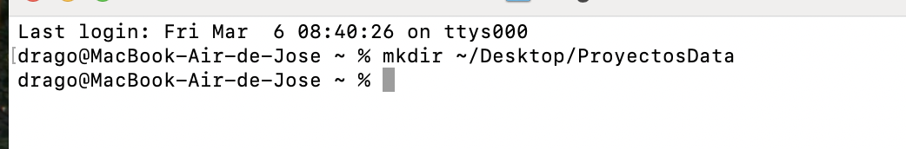
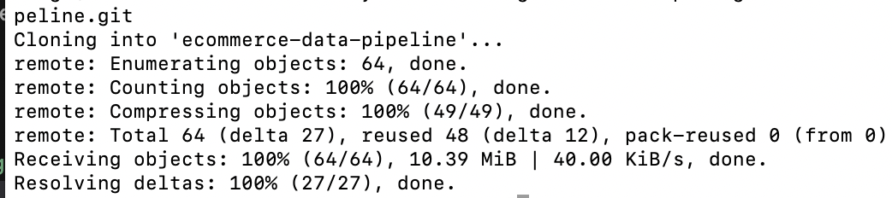
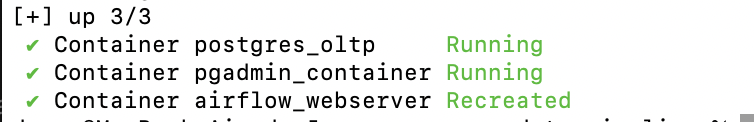
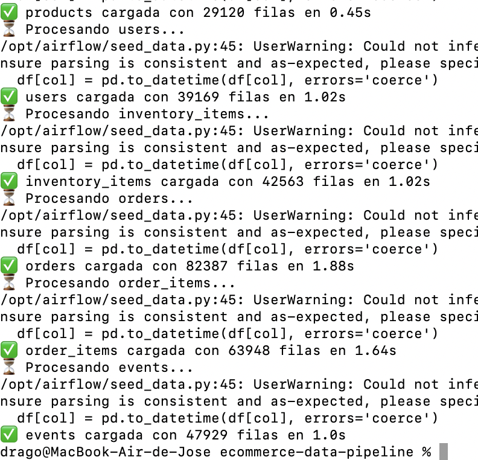
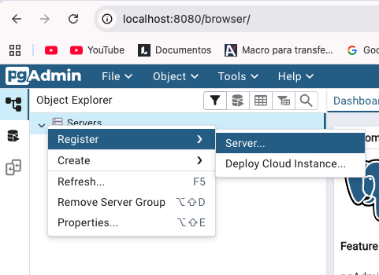
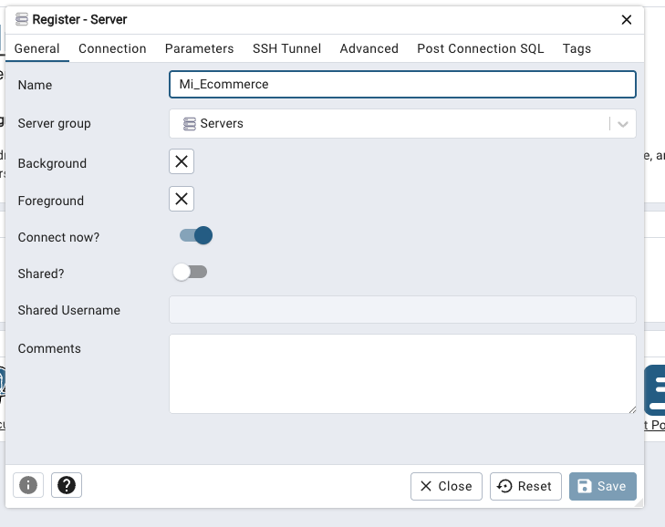
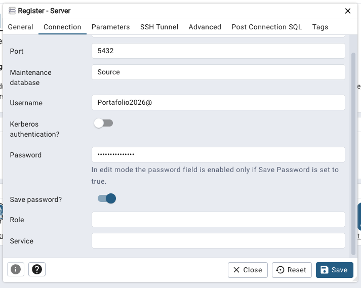
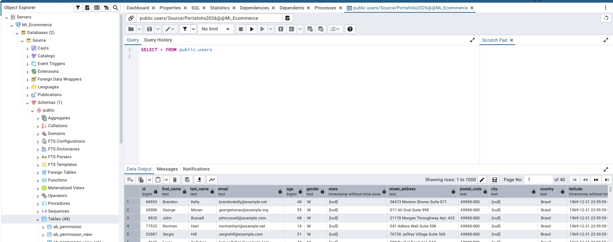

### 📄 STAGE_01: Configuración del Sistema de Origen (OLTP)

Metodología de la Etapa:
En esta fase inicial, aplicamos el principio de Aislamiento de Entornos. En lugar de instalar bases de datos y lenguajes de programación directamente en su computadora (evitando conflictos de versiones), utilizamos Docker. La metodología consiste en levantar un ecosistema transaccional donde Airflow no solo orquestará tareas en el futuro, sino que proveerá el motor de ejecución para nuestra carga inicial de datos (Seeding), garantizando que el dataset de +150,000 registros sea consistente para cualquier usuario.

---

### 1. Requerimientos Técnicos (Instalación de Herramientas)
Antes de tocar el proyecto, debes instalar estos dos programas que permiten que todo funcione de forma automática.

Docker Desktop: Es el programa que creará una "computadora virtual" dentro de la tuya para que corra la base de datos y Python sin que tengas que configurar nada extra.

* 👉 [Descargar Docker Desktop para Windows/Mac/Linux](https://www.docker.com/products/docker-desktop/)
( este ejercico esta realizado con un sistema operativo Mac)

Nota: Una vez instalado, asegúrate de abrirlo y que el "ballenita" en la barra de tareas esté en verde.

Git: Es la herramienta que usaremos para descargar (clonar) el proyecto desde la nube a tu carpeta local.

* 👉 [Descargar Git para todos los sistemas](https://git-scm.com/downloads)

--- 

### 2. Descarga del Proyecto (Clonar Repositorio)

Ahora vamos a traer una copia de todo el código a tu computadora.

1. Crea una carpeta en tu computadora donde quieras guardar el proyecto (ejemplo: en el Escritorio, llamada ProyectosData).

```bash
 cd mkdir ~/Desktop/ProyectosData
```


2. Abre una terminal y entra a esa carpeta.

```bash
 cd ~/Desktop/ProyectosData
```

3. Copia y pega el siguiente comando:

```bash
git clone https://github.com/AlbertDataMaster/ecommerce-data-pipeline.git
```


4. Entra a la carpeta del proyecto:

```bash
cd ecommerce-data-pipeline
```
---

### 3. Levantar los Servicios (Docker)

1. En este paso, Docker leerá nuestro archivo docker-compose.yml y encenderá la base de datos y el administrador visual automáticamente.

1. En la misma terminal donde estás parado, escribe:

```bash
docker-compose up -d
```


2. ¿Qué está pasando?

* postgres_oltp: Se está creando tu base de datos profesional.
* pgadmin: Se está activando el panel de control para que veas los datos en tu navegador.
* airflow-scheduler: Se está preparando el motor de Python que cargará los datos.

---

### 4. Carga de Datos Masiva (Data Seeding)

Tu base de datos está encendida pero vacía. Vamos a usar el motor de Python que ya viene dentro de Airflow para llenarla con los archivos que están en la carpeta /data.

Ejecuta este comando:

```bash
docker exec -it airflow_scheduler python /opt/airflow/seed_data.py
```

* ¿Qué hace este comando? Le ordena a Airflow que ejecute el archivo seed_data.py. Este script toma los archivos de Excel (CSV) y los inserta en la base de datos de forma ultra rápida.



### 5. Validación: Ver tus datos en el navegador

Para confirmar que lo lograste, vamos a entrar al administrador visual:

1. Abre tu navegador (Chrome o Edge) y escribe: http://localhost:8080

2. Ingresa estos datos:

* Usuario: admin@admin.com

* Contraseña: admin

3. Conecta la base de datos:

* Haz clic derecho en "Servers" -> "Register" -> "Server".



* En la pestaña General, nombre: Mi_Ecommerce.


* En la pestaña Connection:

* Host: postgres_oltp
* Maint. Database: Source
* username: Portafolio2026@
* Password: Portafolio2026@
* save 



¡Listo! Ve a Databases > Source > Schemas > Public > Tables. Deberías ver tablas como users y orders con miles de filas.



---

### 🎯 Conclusión de la Etapa
Al finalizar este hito, hemos recreado con éxito el escenario de origen. Tenemos una base de datos con +150,000 registros que simulan un historial de ventas real.

Este es el "caos" de datos transaccionales que ahora, en la Etapa 2, vamos a organizar y orquestar para que puedan viajar hacia la nube.

👉 **Ir a [STAGE_02.md: Orquestación con Airflow](STAGE_02.md)**