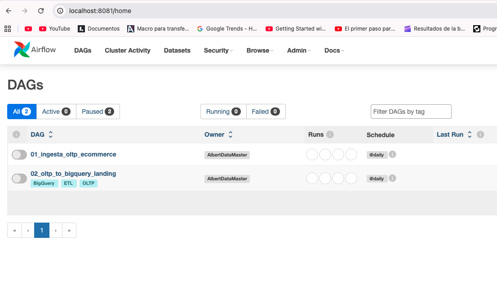
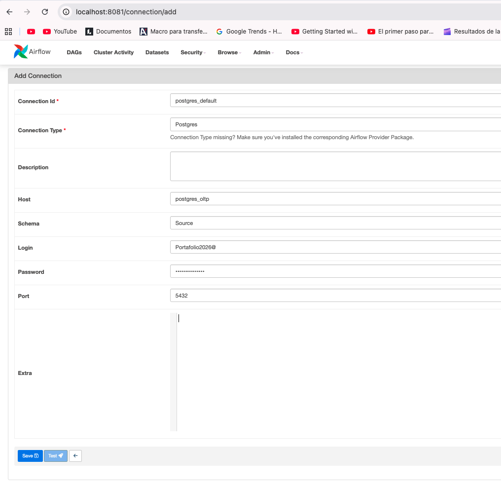
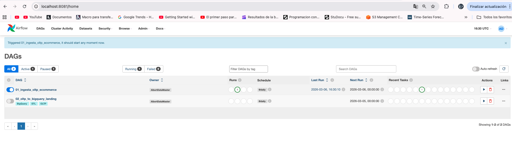
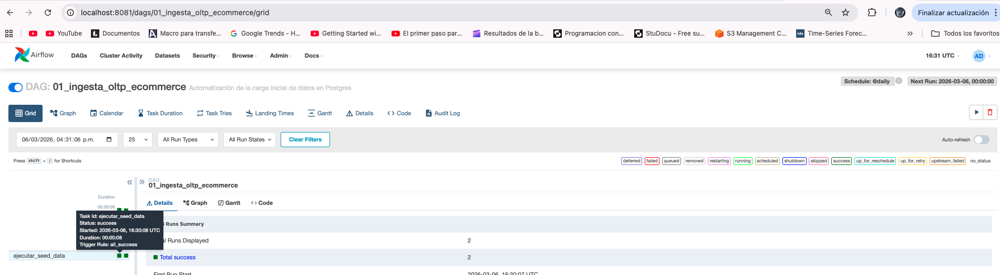
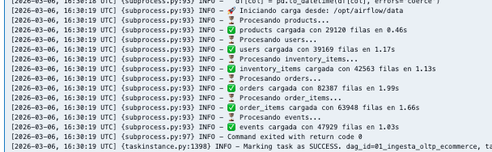

### 📄 STAGE_02.md: Orquestación y Automatización (Apache Airflow)
Metodología de la Etapa:
En esta fase aplicamos el principio de Orquestación de Datos. En el mundo real, los datos no se mueven solos; necesitan un director de orquesta. Apache Airflow cumple esta función mediante DAGs (Grafos Acíclicos Dirigidos), que son secuencias de pasos programados que se ejecutan automáticamente. Aquí configuraremos la comunicación interna entre nuestros contenedores para que el pipeline cobre vida.

### 1. Acceso a la Interfaz de Airflow
Gracias a la configuración realizada en el Stage 01, Airflow ya está corriendo.

1. Abre tu navegador e ingresa a: http://localhost:8081

* Nota: Usamos el puerto 8081 para no entrar en conflicto con pgAdmin que está en el 8080.

2. Credenciales de acceso:

* Usuario: admin

* Contraseña: admin

3. Resultado esperado: Verás una pantalla con tus dos procesos principales:

* 01_ingesta_oltp_ecommerce: Encargado de la base de datos local.
* 02_oltp_to_bigquery_landing: Encargado de enviar los datos a Google Cloud.

---

### 2. Configuración de la Conexión a PostgreSQL
Para que Airflow pueda "extraer" la información, debemos darle las llaves de la base de datos local:

1. En el menú superior, ve a Admin > Connections.
2. Haz clic en el símbolo + para añadir una nueva.
3. Configura los campos con estos valores exactos de tu docker-compose.yml:

* Conn Id: postgres_default
* Conn Type: Postgres
* Host: postgres_oltp
* Schema: Source
* Login: Portafolio2026@
* Password: Portafolio2026@
* Port: 5432
* Presiona Save.

* ⚠️ Nota para el usuario: Si al guardar recibes un error de "Integrity Error / Unique Constraint", es porque ya existe una conexión con ese nombre. Simplemente edita la existente en lugar de crear una nueva.

### 3. Activación de los ETLs (DAGs)
Ahora pondremos en marcha la automatización. Sigue este orden:

* Paso A: Sincronización Local
Localiza el DAG 01_ingesta_oltp_ecommerce.

1. Activa el interruptor a la izquierda (de gris a azul).
2. Haz clic en el botón de Play (Trigger DAG) a la derecha.

¿Qué hace? Este proceso asegura que todos los datos transaccionales estén validados y listos en tu base de datos local.

* Paso B: Preparación para la Nube
1. Localiza el DAG 02_oltp_to_bigquery_landing.
Nota: No lo actives aún hasta completar el Stage 03, ya que este requiere las credenciales de Google Cloud.

---

### 🚀 ¿Qué emula esto en el mundo real?

Esto emula la Gestión de Secretos y Conexiones de una empresa. En lugar de escribir la contraseña directamente en el código del ETL (lo cual es un riesgo de seguridad), se guarda en el "Bóveda" de Airflow. Así, el código solo pregunta por postgres_default y Airflow entrega las llaves de forma segura.

👉 **Ir a [STAGE_03.md: Orquestación con Airflow](STAGE_03.md)**