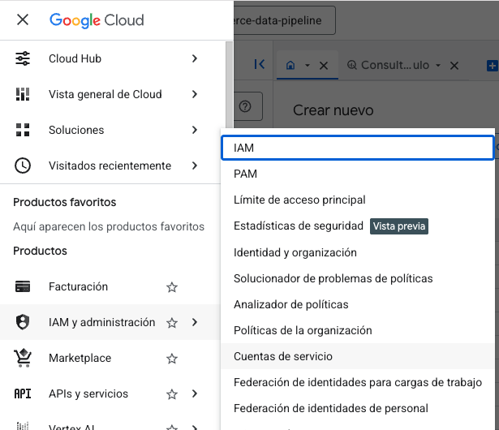
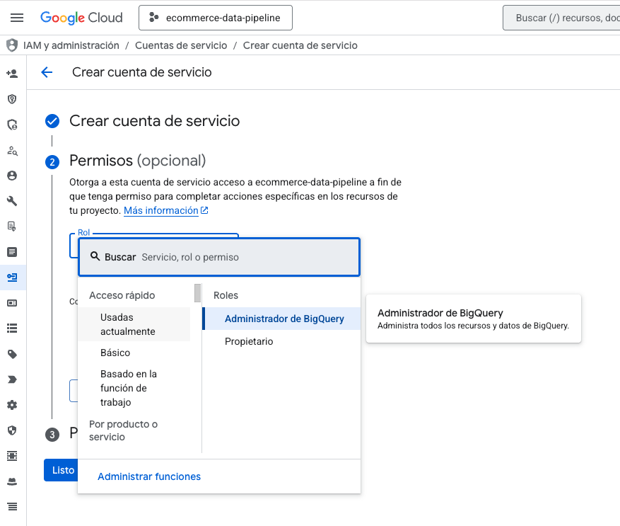
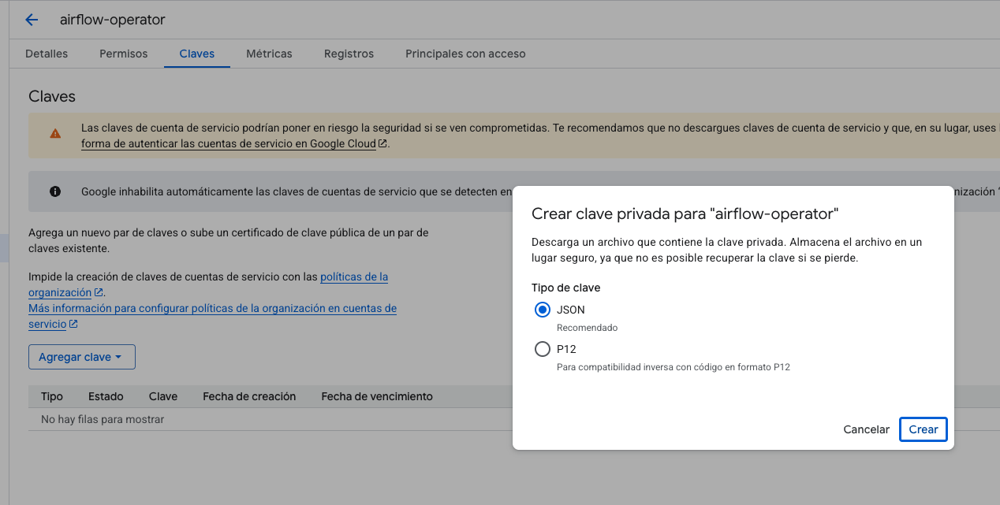
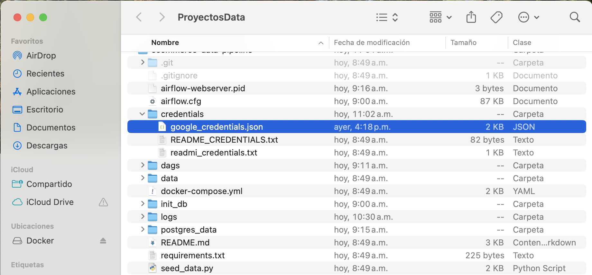
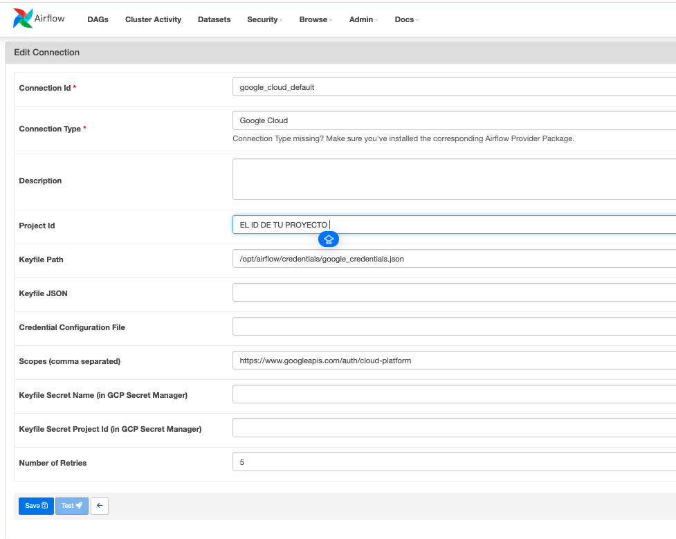
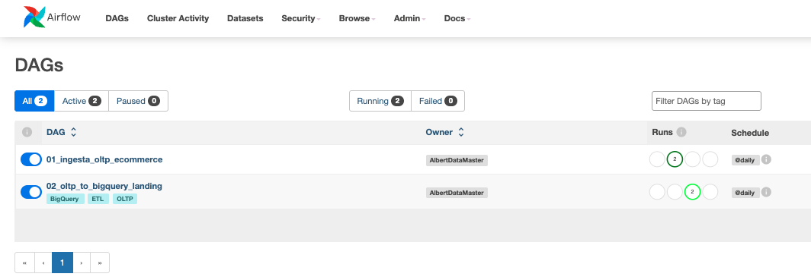
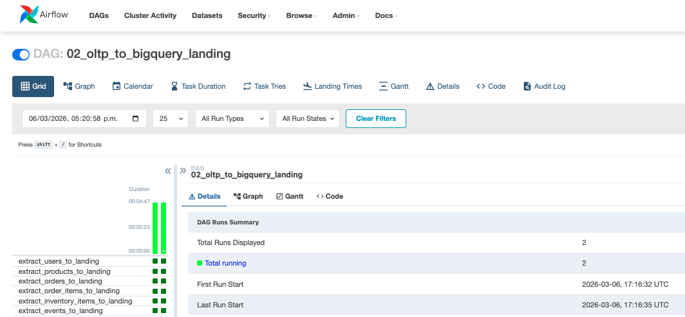
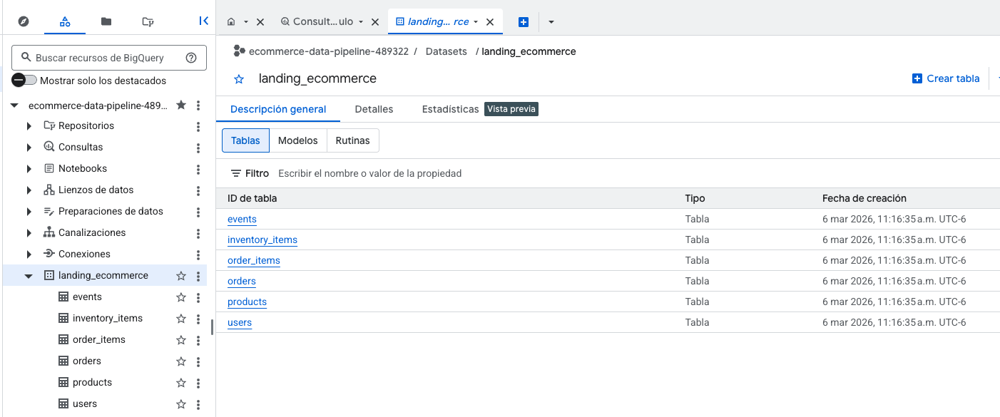

### 🚀 STAGE_03.md: Ingesta en la Nube (Google BigQuery)

Metodología de la Etapa:
Aquí aplicamos el concepto de Cloud Data Warehousing. El objetivo es mover los datos desde nuestro contenedor local hacia BigQuery, utilizando una Service Account (Llave de seguridad) para garantizar que la conexión sea privada y segura.

---

1. Configuración en Google Cloud (GCP)
Para este paso, necesitas una cuenta de Google Cloud (puedes usar el nivel gratuito).

* Crear Proyecto: Crea un nuevo proyecto llamado ecommerce-data-pipeline.
* Habilitar BigQuery: Asegúrate de que la API de BigQuery esté activa.
* Crear Dataset: En BigQuery, crea un dataset llamado landing_ecommerce. Aquí es donde aterrizarán nuestras tablas.

2. Seguridad: Creación de la Llave (JSON)
Airflow no puede entrar a tu nube sin una "identificación".

* Ve a IAM y administración > Cuentas de servicio.

* Crea una cuenta con el rol de Administrador de BigQuery.

* En la pestaña Claves, selecciona Agregar clave > Crear clave nueva (JSON).

IMPORTANTE: Se descargará un archivo .json. Cámbiale el nombre a google_credentials.json y guárdalo en la carpeta /credentials de tu proyecto local.

🔒 Nota: Este archivo nunca se subirá a GitHub porque está protegido por nuestro .gitignore.

---

### 3. Conexión de Google Cloud en Airflow
Ahora regresemos a localhost:8081 para darle la llave a Airflow:

* Ve a Admin > Connections y busca google_cloud_default.

1. Haz clic en el lápiz para editar y llena estos campos:

* Project Id: El ID de tu proyecto de Google Cloud.
* Keyfile Path: /opt/airflow/credentials/google_credentials.json
* Scopes: https://www.googleapis.com/auth/cloud-platform
* Haz clic en Save.

---

### 4. Ejecución del ETL Final
Ahora es el momento de ver la magia:

1. Activa el DAG 02_oltp_to_bigquery_landing.
2. Presiona Play.
3. ¿Qué está pasando? Airflow está extrayendo los datos de tu Postgres local, los está transformando y los está subiendo a la nube de Google automáticamente.

---

### 5. Validación en la Nube
Entra a tu consola de Google BigQuery. Si todo salió bien, verás tus tablas (users, orders, products) con todos los datos disponibles para hacer consultas SQL en la nube.

---

### Resultado de esta Etapa:

"Contamos con un sistema funcional, versionado y documentado que permite migrar datos de forma automática, eliminando procesos manuales y errores humanos."

