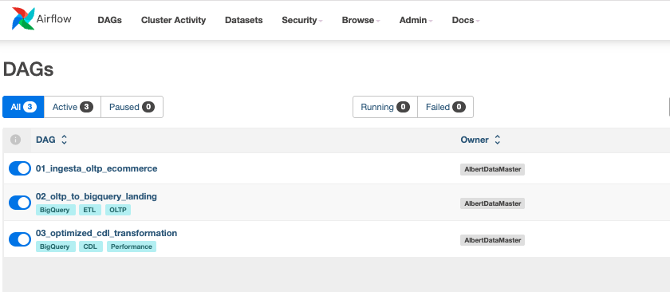

### 📄 STAGE_04: Core Data Layer (CDL) & Dimensional Modeling

## 🧩 Metodología de la Etapa

Para la construcción del Core Data Layer (CDL), hemos adoptado una metodología basada en los estándares de la Arquitectura de Medallón (Capa Silver) y el Modelado Dimensional de Ralph Kimball. El proceso sigue un flujo riguroso de cuatro pasos:

1. Ingestión y Limpieza (Data Scrubbing)
2. Normalización Dimensional (Star Schema Design)
3. Ingeniería de Performance (Optimization)
4. Encapsulamiento e Idempotencia

Esta etapa se enfoca en la transformación de los datos crudos de la Landing Zone (LZ) hacia un modelo analítico robusto y de alto rendimiento utilizando BigQuery y Airflow.

---

### Preparación del Dataset en BigQuery
Antes de ejecutar las transformaciones, es necesario contar con el dataset de destino.

1. Ve a la consola de BigQuery.
* Crea un nuevo dataset llamado core_ecommerce en la misma región que tu landing_ecommerce.

2. Definición de la Lógica de Transformación (SQL)
* Para garantizar la idempotencia y el rendimiento, utilizaremos un Stored Procedure. Este encapsula el modelo estrella y las mejores prácticas de BigQuery.

* Paso A: Creación del Procedimiento Almacenado
Ejecuta el siguiente código en una pestaña de consultas de BigQuery. Este script crea las dimensiones y la tabla de hechos con Particionamiento y Clustering.

* {id_proyecto} remplaza por el id de tu proyecto de GCP.

```bash
CREATE OR REPLACE PROCEDURE `{id_proyecto}.core_ecommerce.sp_build_cdl_optimized`()
BEGIN

  -- 1. DIMENSIÓN TIEMPO
  CREATE OR REPLACE TABLE `{id_proyecto}.core_ecommerce.dim_date`
  CLUSTER BY year, month
  AS
  SELECT DISTINCT
      CAST(FORMAT_DATE('%Y%m%d', DATE(created_at)) AS INT64) AS date_key,
      DATE(created_at) AS date,
      EXTRACT(YEAR FROM created_at) AS year,
      EXTRACT(MONTH FROM created_at) AS month,
      EXTRACT(DAY FROM created_at) AS day,
      FORMAT_DATE('%B', created_at) AS month_name
  FROM `{id_proyecto}.landing_ecommerce.orders`;

  -- 2. DIMENSIÓN USUARIOS (Aseguramos que user_id sea INT64)
  CREATE OR REPLACE TABLE `{id_proyecto}.core_ecommerce.dim_users`
  CLUSTER BY country, city, user_id
  AS
  SELECT CAST(id AS INT64) AS user_id, first_name, last_name, email, age, gender, state, city, country, traffic_source, created_at
  FROM `{id_proyecto}.landing_ecommerce.users`;

  -- 3. DIMENSIÓN PRODUCTOS
  CREATE OR REPLACE TABLE `{id_proyecto}.core_ecommerce.dim_products`
  CLUSTER BY category, product_id
  AS
  SELECT CAST(id AS INT64) AS product_id, name, brand, category, department, retail_price, cost
  FROM `{id_proyecto}.landing_ecommerce.products`;

  -- 4. DIMENSIÓN INVENTARIO
  CREATE OR REPLACE TABLE `{id_proyecto}.core_ecommerce.dim_inventory`
  PARTITION BY DATE(created_at)
  CLUSTER BY product_id
  AS
  SELECT CAST(id AS INT64) AS inventory_item_id, CAST(product_id AS INT64) AS product_id, created_at, sold_at, cost, product_category, product_brand
  FROM `{id_proyecto}.landing_ecommerce.inventory_items`;

  -- 5. DIMENSIÓN EVENTOS (Corregido: eliminamos clustering de secuencias si son floats)
  CREATE OR REPLACE TABLE `{id_proyecto}.core_ecommerce.dim_events`
  PARTITION BY DATE(event_date)
  CLUSTER BY user_id, event_type
  AS
  SELECT CAST(id AS INT64) AS event_id, CAST(user_id AS INT64) AS user_id, sequence_number, session_id, CAST(created_at AS TIMESTAMP) AS event_date, event_type
  FROM `{id_proyecto}.landing_ecommerce.events`;

  -- 6. TABLA DE HECHOS: VENTAS (FACT_SALES)
  CREATE OR REPLACE TABLE `{id_proyecto}.core_ecommerce.fact_sales`
  PARTITION BY sale_date
  CLUSTER BY product_id, user_id, status
  AS
  SELECT 
      CAST(oi.id AS INT64) AS sale_id, CAST(oi.order_id AS INT64) AS order_id, 
      CAST(oi.user_id AS INT64) AS user_id, CAST(oi.product_id AS INT64) AS product_id, 
      CAST(oi.inventory_item_id AS INT64) AS inventory_item_id,
      DATE(oi.created_at) AS sale_date,
      CAST(FORMAT_DATE('%Y%m%d', DATE(oi.created_at)) AS INT64) AS date_key,
      oi.status, CAST(oi.sale_price AS NUMERIC) AS sale_price, 
      CAST(p.cost AS NUMERIC) AS product_cost, (oi.sale_price - p.cost) AS margin
  FROM `{id_proyecto}.landing_ecommerce.order_items` oi
  JOIN `{id_proyecto}.landing_ecommerce.products` p ON oi.product_id = p.id;

END;
```

---

### 3. Orquestación con Apache Airflow

Para automatizar este proceso, crearemos un DAG que invoque el procedimiento anterior de forma programada.

* Ingresamos a http://localhost:8081 y ejecutamos el dag 03_optimized_cdl_transformation



### 4. Validación del Performance Tuning

Una vez ejecutado el DAG, verifica en Google Cloud Console que las tablas posean las optimizaciones configuradas:

Técnica,Verificación en Consola
Partitioning,"Pestaña ""Details"" -> Partitioned by: sale_date."
Clustering,"Pestaña ""Details"" -> Clustered by: product_id, user_id, status."
Data Types,"Pestaña ""Schema"" -> Los IDs deben ser INTEGER y precios NUMERIC."

👉 **Ir a [🔹 Fase 5: Reporting Data Layer (RDL) e Inteligencia Artificial ](STAGE_05.md)**