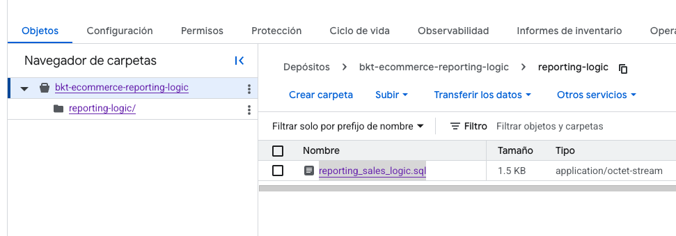
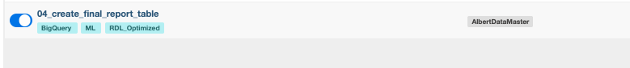
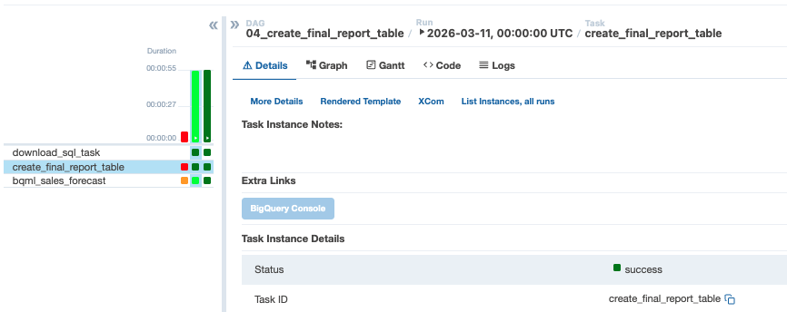

### 🧩 Metodología de la Etapa 5: Reporting Data Layer (RDL)

En esta fase, consolidamos la lógica de negocio final y preparamos el entorno para la analítica avanzada. El proceso se divide en la materialización de datos optimizados y la creación del motor de inteligencia artificial:

1. Despliegue de Lógica Externa: Gestión de scripts SQL desde GCS.

2. Materialización RDL: Construcción de la tabla de hechos final con alta performance.

3. Entrenamiento de IA: Implementación del modelo de series temporales en el Data Warehouse.

4. Orquestación Híbrida: Uso de Python Hooks para garantizar la ejecución en entornos distribuidos.

---

### Configuración de la Lógica de Negocio (SQL)

Para esta etapa, la lógica de transformación final se desacopla del código de Python para permitir actualizaciones rápidas.

1. Crea el archivo reporting_sales_logic.sql con la agregación necesaria para tus insights:
```bash
SELECT 
    -- 1. Eje Temporal
    d.date AS full_date,
    d.year,
    d.month_name,

    -- 2. Eje Geográfico y Demográfico
    u.country,
    u.city,
    u.gender,
    u.traffic_source,
    -- Regla de Negocio: Segmentación Etaria
    CASE 
        WHEN u.age < 18 THEN 'Gen Z (Menores)'
        WHEN u.age BETWEEN 18 AND 34 THEN 'Millennials'
        WHEN u.age BETWEEN 35 AND 50 THEN 'Gen X'
        ELSE 'Seniors'
    END AS customer_segment,

    -- 3. Eje de Producto (Consistente con dim_products)
    p.name AS product_name,
    p.category,
    p.brand,

    -- 4. Métricas Financieras y Reglas de Rentabilidad
    f.sale_price,
    f.product_cost,
    f.margin AS profit_amount,
    SAFE_DIVIDE(f.margin, f.sale_price) AS margin_rate,
    
    -- Regla de Negocio: Clasificación de Rentabilidad
    CASE 
        WHEN SAFE_DIVIDE(f.margin, f.sale_price) > 0.6 THEN 'Alta Rentabilidad'
        WHEN SAFE_DIVIDE(f.margin, f.sale_price) BETWEEN 0.3 AND 0.6 THEN 'Rentabilidad Media'
        ELSE 'Margen Crítico'
    END AS profit_tier,

    -- 5. Eje Operativo
    f.status AS order_status

FROM `{id_proyecto}.core_ecommerce.fact_sales` f
JOIN `{id_proyecto}.core_ecommerce.dim_users` u ON f.user_id = u.user_id
JOIN `{id_proyecto}.core_ecommerce.dim_products` p ON f.product_id = p.product_id
JOIN `{id_proyecto}.core_ecommerce.dim_date` d ON f.date_key = d.date_key;

```
---

### 2. Creación del Bucket en GCP.

1. En tu proyecto de GCP , crea un bucker con el nombre : bkt-ecommerce-reporting-logic
2. Dentro de tu nuevo bucket , crea la carpeta : reporting-logic/
3. Dentro de la carpeta carga tu archivo .sql : reporting_sales_logic.sql

* Nota: Es necesario que la cuenta de servicio que estas utilizando para este proyecto , tenga los permisos de : visualizador de objetos de storage




### 3. Creación del Dataset de Reporteo

1. Ve a la consola de BigQuery.
2. Crea un dataset llamado reporting_ecommerce.

### 3. Orquestación del Pipeline Final

* Ejecutaremos el DAG 04_create_final_report_table el cual realiza el flujo completo de esta etapa.

1. Accede a Airflow (http://localhost:8081).
2. Activa el DAG. Este realizará automáticamente:
*  Descarga de la lógica desde GCS usando GCSHook.
* Creación de final_sales_report con Particionamiento Diario y Clustering.
* Entrenamiento del modelo ARIMA_PLUS llamado model_sales_forecast.





### 4. Insight Quick-Check

1. Verifica que tus datos estén listos con esta consulta rápida:

```bash
SELECT country, category, SUM(total_sales) as revenue
FROM `{id_proyecto}.reporting_ecommerce.final_sales_report`
GROUP BY 1, 2
ORDER BY revenue DESC
LIMIT 5;

```